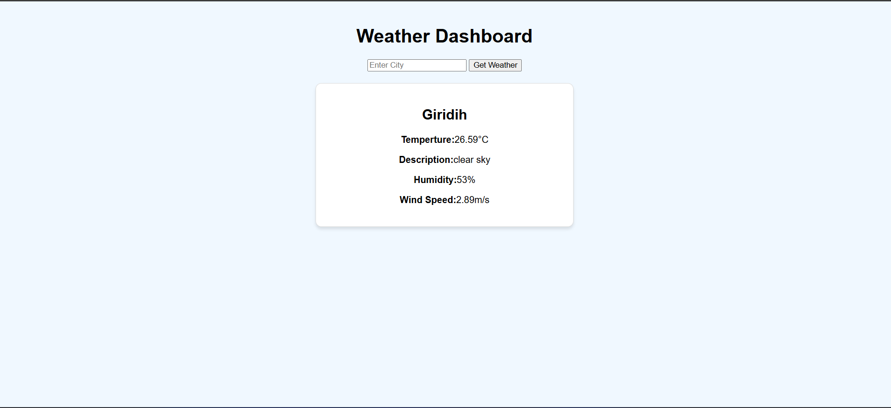

---

# 🌦️ Weather Dashboard App

A dynamic web application that allows users to search and view real-time weather information for any city. The app uses Python on the backend and HTML on the frontend, integrating with the OpenWeatherMap API for live data.

---
## 📸 Screenshot

Here’s a preview of the Weather Dashboard Website:



---
## 🚀 Features

- 🌍 Search current weather by city name  
- 📅 Get 5-day weather forecast  
- 🌡️ View temperature, humidity, wind speed, and conditions  
- 🕓 Real-time weather updates using OpenWeatherMap API  
- 🔁 Stores recent search history (if implemented)  
- 📱 Responsive and clean UI

---

## 🔧 Tech Stack

- **Frontend**: HTML (optionally CSS for styling)  
- **Backend**: Python (Flask or any framework you used)  
- **API**: [OpenWeatherMap API](https://openweathermap.org/api)

---

## 🛠️ Installation

1. **Clone the repository**
   ```bash
   git clone https://github.com/your-username/weather-dashboard.git
   ```

2. **Navigate to the project folder**
   ```bash
   cd weather-dashboard
   ```

3. **Create and activate a virtual environment** (optional but recommended)
   ```bash
   python -m venv venv
   source venv/bin/activate  # or venv\Scripts\activate on Windows
   ```

4. **Install required dependencies**
   ```bash
   pip install -r requirements.txt
   ```

5. **Run the application**
   ```bash
   python app.py
   ```

6. **Open your browser and go to**
   ```
   http://127.0.0.1:5000
   ```

---

## 🔑 API Key Setup

1. Sign up at [https://openweathermap.org/api](https://openweathermap.org/api)
2. Generate your API key
3. Add your API key to your Python file, for example:
   ```python
   api_key = "YOUR_API_KEY"
   ```

---

## 📁 Project Structure

```
weather-dashboard/
│
├── templates/
│   └── index.html
├── app.py
└── README.md
```

---

## 📌 Future Enhancements

- Add geolocation-based weather  
- Store and display recent searches  
- Hourly forecast view  
- Add styling with Bootstrap or Tailwind CSS

---

## 🙌 Acknowledgements

- [OpenWeatherMap](https://openweathermap.org/)
- Python community for amazing open-source tools

---

## 📃 License

This project is licensed under the MIT License - see the [LICENSE](LICENSE) file for details.

---

Let me know if you're using Flask or any specific framework—I can tailor this even more!
